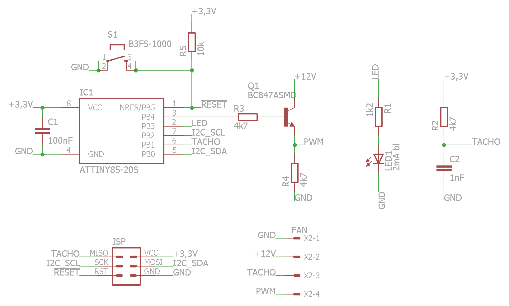

# ATtiny I²C Fan Control

Control a PWM fan over the I²C bus.

**Tests:** 

*ATtiny I²C Fan Control* is made as a [PlatformIO](https://platformio.org/) project.

## Supported features

* Set fan speed by using a PWM signal
* Set fan speed via I²C bus
* Read the current fan RPM via I²C bus
* Auto adjust PWM range by testing the connected fan at startup (can be re-triggered by I²C bus)
* Override min PWM level by I²C bus

## Currently supported AVR controllers

* [ATtiny85](https://ww1.microchip.com/downloads/en/DeviceDoc/Atmel-2586-AVR-8-bit-Microcontroller-ATtiny25-ATtiny45-ATtiny85_Datasheet.pdf)

Adjustments for other AVR microcontrollers should be easy.

## I²C registers

| Register | Description |
|---|---|
| 0x00 | **Status** - By writing a 1 to bit 0 of this register you can trigger a re-calibration of the fan. |
| 0x01 | **Fan speed** - By writing to this register you can set the fan speed. A value of `0` means "fan off" and `255` is full speed. |
| 0x02 | **Minimal PWM level** - Read or write the minimal PWM level at which the fall will rotate when *fan speed* is set to `1`. This will be detected automatically at startup. |
| 0x03 | **Current fan speed in revolutions per second (RPS)** - Read the current fan speed in RPS. This is calculated from the fan tacho signal. |
| 0x04 and 0x05 | **Current fan speed in revolutions per minute (RPM)** - Read the current fan speed in RPM. This is calculated from the fan tacho signal. `0x04` is the low-byte and `0x05` the high-byte. |

### Hint on I²C bus

Since the ATtiny microcontrollers use a USI (Universal Serial Interface) to provide the I²C bus, there may be some problems reading or writing more than one byte at once.  
To overcome this issue you should read/write byte by byte, even if want to read the fan speed in RPM.

## Wiring

## Projects using ATtiny I²C Fan Control

* [Active cooling of the "HomePi"](https://crycode.de/homepi-kuehlung) (German)

## Used Libraries

* [Arduino Framework](https://platformio.org/frameworks/arduino)
* [PinChangeInterrupt](https://platformio.org/lib/show/725/PinChangeInterrupt)
* [TinyWireSio](https://platformio.org/lib/show/293/TinyWireSio)

## License

**CC BY-NC-SA 4.0**

[Creative Commons Attribution-NonCommercial-ShareAlike 4.0 International](https://creativecommons.org/licenses/by-nc-sa/4.0/)

Copyright (C) 2020-2021 Peter Müller <peter@crycode.de> [https://crycode.de](https://crycode.de)